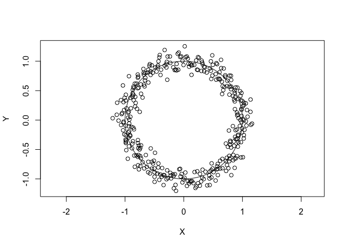
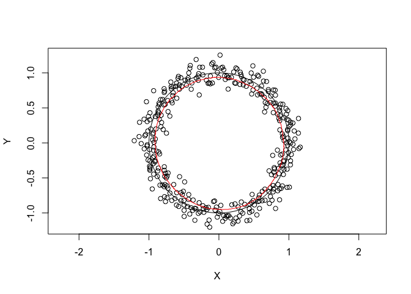
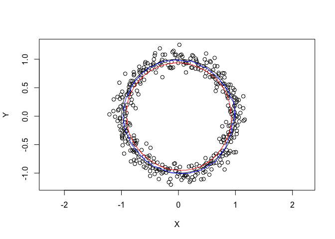

<!-- README.md is generated from README.Rmd. Please edit that file -->

# manifoldreduction

<!-- badges: start -->

[](https://travis-ci.org/jefferis/manifoldreduction)
<!-- badges: end -->

An implementation of Chigirev and Bialek’s algorithm described in
“Optimal Manifold Representation of Data: An Information Theoretic
Approach”.

## Quick Start

For the impatient …

``` r
# install
if (!require("devtools")) install.packages("devtools")
devtools::install_github("jefferis/manifoldreduction")

# use
library(manifoldreduction)

# get overview help for package
?manifoldreduction
# help for functions
?manifold_reduction

# run tests
library(testthat)
test_package("manifoldreduction")
```

## Installation

Currently there isn’t a released version on
[CRAN](http://cran.r-project.org/) but you can use the **remotes**
package to install the development version:

``` r
if (!require("remotes")) install.packages("remotes")
devtools::install_github("jefferis/manifoldreduction")
```

Note: Windows users may need
[Rtools](http://www.murdoch-sutherland.com/Rtools/) and
[remotes](http://CRAN.R-project.org/package=devtools) to install this
way.

## Example

As an example, let’s use a noisy 2D circle. First a helper function for
the parametric form of the equation of a circle:

``` r
circle <- function(r = 1, x = 0, y = 0, n = 360) {
  theta = seq(from = 0,
              to = 2 * pi,
              length.out = n)
  cbind(X = x + r * cos(theta), Y = y + r * sin(theta))
}
```

Now we can add a bit of noise to the radius

``` r
noisy_circle=circle(r=rnorm(360, mean=1, sd=.1))
plot(noisy_circle, asp = 1)
lines(circle(), col='black')
```



Now let’s try recovering a low dimensional manifold. The default
parameters will essentially look for a line.

``` r
library(manifoldreduction)
# NB expects d x N points (not N x d)
q=manifold_reduction(t(noisy_circle), no_iterations = 10, Verbose=FALSE)
```

This toy example converges fast, so I have reduced the number of
iterations. If you plot the results (red line), you can see that it does
a good job of smoothly recovering the structure of the original input
points.

``` r
plot(noisy_circle, asp=1)
lines(circle(), col='black')
lines(t(q$gamma), col='red')
```



However there is a clear bias in the position of the recovered circle.
This is down to the structure in these data - distant points in the
dataset still contribute to the reconstruction of the manifold which
will therefore be biased towards a medial position. If one reduces the
number of points that are
used:

``` r
q2=manifold_reduction(t(noisy_circle), no_iterations = 10, Verbose=FALSE, knntouse = 40)
plot(noisy_circle, asp=1)
lines(circle(), col='black')
lines(t(q$gamma), col='red')
lines(t(q2$gamma), col='blue')
```



then one obtains a less biased but somewhat noisier estimate (blue)
(compare with the previous estimate in red or the underlying circle in
black).

Of course this toy example could be better solved if one used a
knowledge of the expected distribution (a circle) as part of the fitting
process. However the interesting point with this method is that it is a
rather general procedure that can be used for arbitrary point
distributions in higher dimensions.
